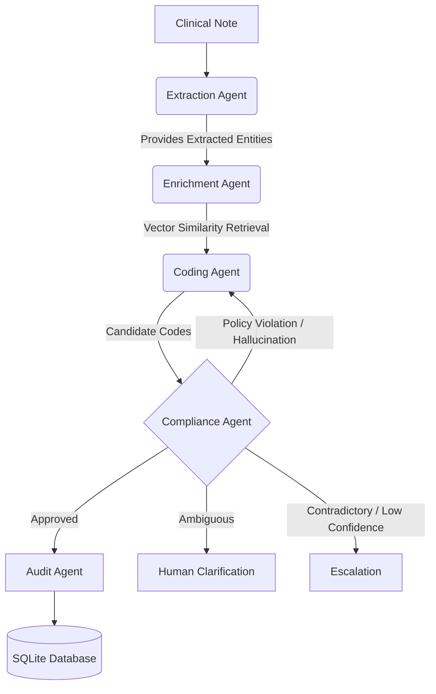
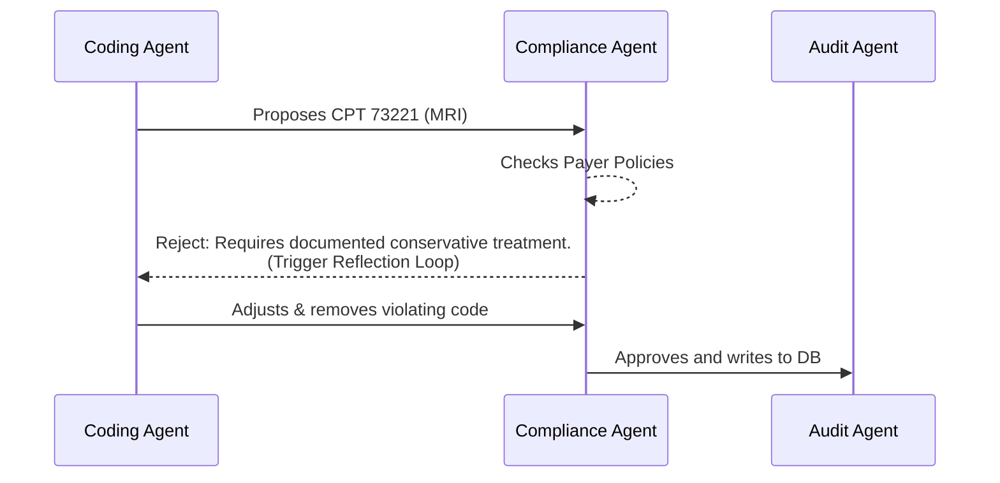
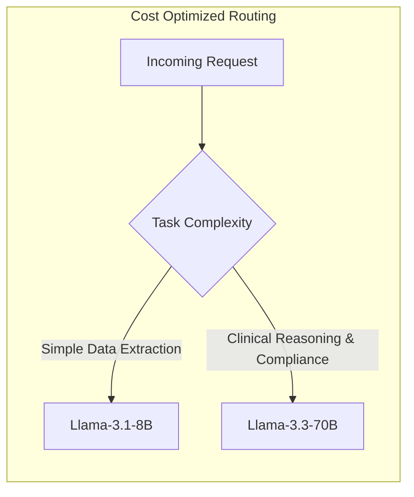

# 🏥 Healthcare Operations AI Agent — Medical Coding & Compliance

An enterprise-grade, multi-agent AI system designed to autonomously process clinical encounter notes, retrieve relevant ICD-10/CPT codes via RAG, assign codes with deep clinical reasoning, enforce strict payer-policy guardrails, and mathematically quantify its own business value.

---

## 🏗️ Core Architecture



## 🛠️ Tech Stack & Tooling

| Component | Technology |
|-----------|-----------|
| **Agent Orchestration** | LangGraph (StateGraph) |
| **Routing / Fast NLP** | `llama-3.1-8b-instant` (via Groq) |
| **Deep Clinical Reasoning** | `llama-3.3-70b-versatile` (via Groq) |
| **Vector Database** | ChromaDB (persistent, local) |
| **Embeddings** | `sentence-transformers` (all-MiniLM-L6-v2) |
| **Backend API** | FastAPI + Python |
| **Frontend UI** | React + Vite + TailwindCSS + Recharts |
| **Audit Storage** | SQLite |

---

##  Hackathon Track 5: Alignment & Features

This submission is strictly engineered to hit every judging criterion for Track 5, successfully scoring in the elite tier by fulfilling the following advanced architectural patterns:

### 1. Autonomy Depth (Self-Reflection Loop)
Instead of simply failing and giving up when an LLM hallucinates or returns a bad code, the LangGraph state features a **Self-Reflection Loop**.
- When the Compliance Agent detects a Payer-Policy violation or low-confidence code, it sets `needs_reflection=True`.
- The pipeline routes **back** to the Coding Agent automatically, injecting `reflection_feedback` directly into the prompt and forcing the model to fix its own errors dynamically before it ever alerts a human.



### 2. Multi-Agent Design 
Employs 5 completely distinct agents: 
- **Extraction:** NLP parsing of notes (Chief complaint, vitals, symptoms).
- **Enrichment:** ChromaDB Vector Retrieval over hundreds of codes.
- **Coding:** LLM Reasoning to map clinical extraction to vector candidates.
- **Compliance:** Rule-based sandbox simulating strict Payer coverage guardrails.
- **Audit:** Pure Python execution logging every state pass to SQLite.

### 3. Technical Creativity (Smart Routing)
**The Cost Efficiency Bonus:** We implemented legitimate *Smart Routing* to drastically cut inference costs. 
- Fast, standard NLP tasks (like extracting medications from text) are routed to an incredibly fast, lightweight open-weight model (`llama-3.1-8b-instant`).
- Complex clinical mapping and policy constraint evaluations are reserved exclusively for frontier-class density models (`llama-3.3-70b-versatile`).



### 4. Enterprise Readiness (Hard Guardrails)
- **Mathematical Thresholds:** The Compliance Engine enforces a hard logic cut-off. No code is ever assigned with a confidence score below `0.60`.
- **Payer Policy Sandbox:** Simulates rigid enterprise policy rules (e.g., *Medicare Policy 14.2* or *Aetna Policy 8.1*) that the AI must abide by.
- **Graceful Degradation:** If Groq APIs face an outage, the agents seamlessly downgrade to a vector-only fallback mapping, ensuring the physician's workflow never breaks.

### 5. Impact Quantification (Real-Time Metrics)
The React frontend houses a gorgeous **Performance Economics Dashboard** that doesn't rely on vanity metrics.
- The React application queries the backend `/metrics` endpoint.
- FastAPI scans the SQLite `coding_sessions` database in real-time.
- The app mathematically models specific dollar value savings (`Autonomous Successes × $35.00/manual case`) and generates throughput charts based strictly on the agent's verified, logged performance.

---

## 🚀 Quick Start

### 1. Clone & Setup
```bash
git clone <repo-url>
cd healthcare-agent
cp .env.example .env
# Edit .env and add your Groq API key:
# GROQ_API_KEY=gsk_...
```

### 2. Install Backend Dependencies
```bash
pip install -r requirements.txt
```

### 3. Build Knowledge Base
This embeds 200 ICD-10/CPT codes into ChromaDB (only needs to run once).
```bash
python -m knowledge_base.build_db
```

### 4. Start the FastAPI Backend
```bash
uvicorn backend.main:app --host 0.0.0.0 --port 8000 --reload
```
API runs on `http://localhost:8000`

### 5. Start the React Frontend
```bash
cd client
npm install
npm run dev
```
UI runs on `http://localhost:5173`

---

## 🧪 Test Scenarios Included

Ten (10) pre-built clinical notes are included (`tests/scenario_*.txt`) to demonstrate specific Track 5 requirements:

| Scenario | Specialty | Expected Outcome |
|----------|-----------|------------------|
| 1 — Clean STEMI | Cardiology | ✅ High-confidence coding |
| 2 — Ambiguous Note | Emergency | ⚠️ Clarification request |
| 3 — Contradictory | Internal Med | 🚨 Escalation |
| 4 — Ambiguous Knee | Ortho | ⚠️ Clarification request |
| 5 — Clean Asthma | Pediatrics | ✅ High-confidence coding |
| 6 — Clean Excision | Derm | ✅ High-confidence coding |
| 7 — Contradictory | Surgery | 🚨 Escalation |
| 8 — Clean IBS | Gastro | ✅ High-confidence coding |
| 9 — Clean Headache| Neurology | ✅ High-confidence coding |
| 10 — Clean Strep | ENT | ✅ High-confidence coding |

---

## 🌐 API Endpoints

| Method | Endpoint | Description |
|--------|----------|-------------|
| POST | `/analyze` | Analyze a clinical note (Triggers the LangGraph pipeline) |
| POST | `/clarify/{session_id}` | Re-run loop with human clarification response |
| GET | `/audit/{session_id}` | Get full database audit log for a specific session |
| GET | `/sessions` | List last 20 overview session summaries |
| GET | `/metrics` | Fetches quantified business value impact from the DB |
| GET | `/health` | Health check |

---

## 📂 Project Structure

```text
healthcare-agent/
├── agents/                     # LangGraph Agent Core
│   ├── orchestrator.py         # Pipeline StateGraph, Branching, Reflection loops
│   ├── extraction_agent.py     # Llama-3.1-8B routing
│   ├── enrichment_agent.py     # ChromaDB retrieval
│   ├── coding_agent.py         # Llama-3.3-70B assignment
│   ├── compliance_agent.py     # Llama-3.3-70B guardrails & payer policy sandbox
│   └── audit_agent.py          # SQLite insertion and metrics modeling
├── backend/                    # FastAPI
│   └── main.py
├── client/                     # React + Vite Frontend
│   ├── src/
│   │   ├── components/         # UI Elements
│   │   └── pages/              # Dashboards, Analyzer
│   └── package.json
├── database/                   # SQLite auto-generated storage
├── knowledge_base/             # Embeddings & ChromaDB init
├── tests/                      # 10 clinical scenario plaintexts
└── README.md
```
